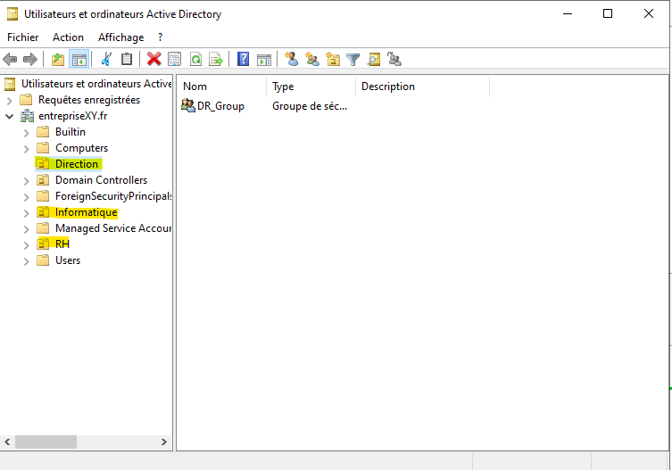
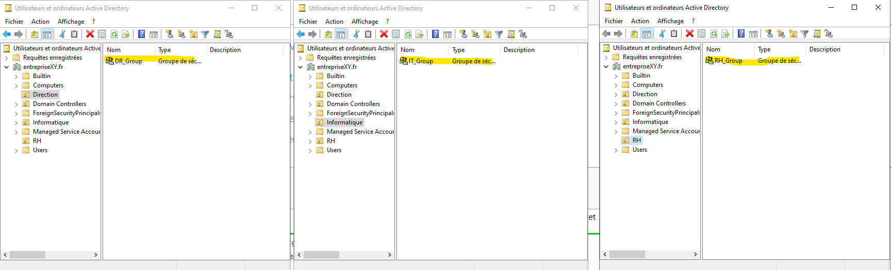
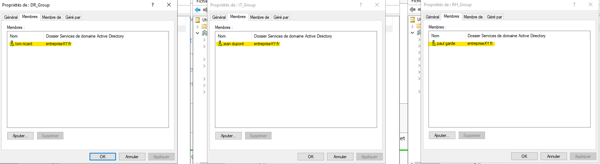
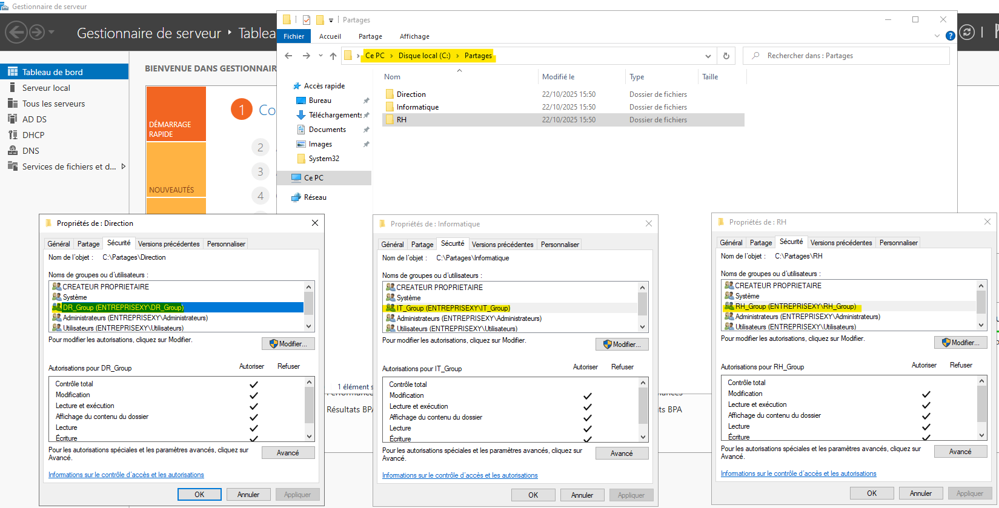

<b>ICI ON PEUT VOIR LES 3 UNITÉES D'ORGANISTION (RH, DIRECTION, INFORMATIQUE)</b>

<b>ICI ON PEUT VOIR LES DIFFÉRENTS GROUPES CRÉÉS DANS LES UNITÉES D'ORGANISATIONS</b>

<b>ICI ON PEUT VOIR LES DIFFÉRENTS UTILISATEURS CRÉÉS DANS LEUR GROUPE</b>

<b>ICI ON PEUT VOIR LE DOSSIER PARTAGE AVEC TROIS DOSSIERS, DIRECTION INFORMATIQUE ET RH.
EN DESSOUS ON PEUT VOIR QUE DANS CHAQUE DOSSIER, SEUL LES GROUPE CORRESPONDANT ON ACCÉS AU DOSSIER</b>

<b>ICI ON PEUT VOIR LES 